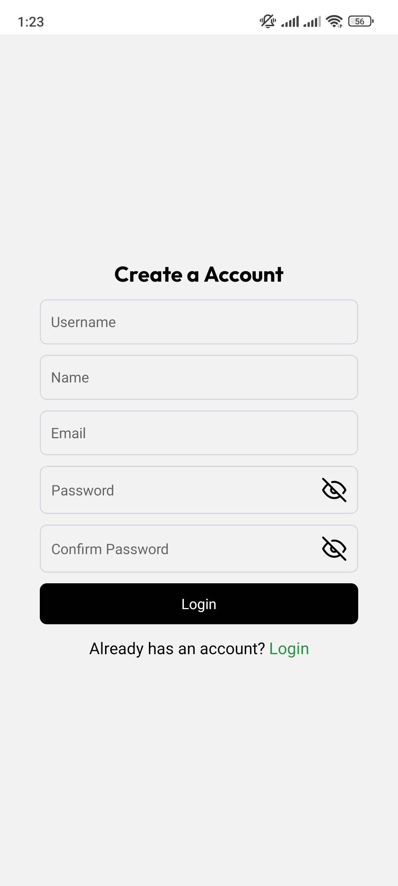
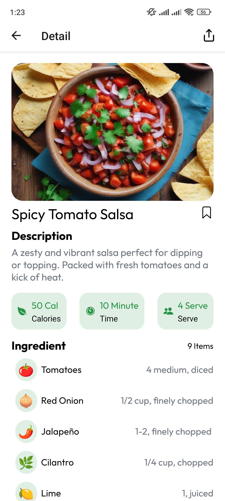

# 📱 Cookmate - AI

Một ứng dụng mobile full-stack được phát triển bằng React Native với backend sử dụng Node.js/Nestjs.  
Ứng dụng cung cấp tính năng tạo công thức nấu ăn với AI, tìm kiếm công thức, lưu công thức và xác thực người dùng.

## 🚀 Tính năng chính

- 🔐 Xác thực người dùng JWT, GoogleOAuth
- 🤖 AI hỗ trợ tạo công thức nấu ăn dựa trên nguyên liệu sẵn có mà người dùng cung cấp
- 🔎 Tìm kiếm công thức nấu ăn và lưu công thức

## 🛠️ Công nghệ sử dụng

### Frontend (Mobile App):
- React Native/Expo
- Redux, React Query, Axios, ReactWind

### Backend:
- Node.js/NestJs 
- PostgreSQL, Cloudinary
- TypeORM, JWT, GoogleOAuth, 
- AI model: OpenRouter (Deepseek), Guru (để tạo hình ảnh)

 [Tải xuống postman folder](postman/postman)

### Modules
- Auth
- User
- File
- Category
- Open Ai
- Guru
- Recipe

### ScreenShot
#### 1. Đăng nhập

#### 2. Đăng kí


#### 3. Home


#### 4. Explore


#### 5. Cook Book


#### 6. Chi tiết công thức



## ⚙️ Cài đặt

### Yêu cầu:
- Node.js >= 18.x
- Yarn / npm
- Android Studio hoặc điện thoại cá nhân

### Backend:
```bash
git clone https://github.com/phapnguyennhat/cookmate-ai.git
cd BE 

# thiết lập biến môi trường dựa vào file .env.examplee
npm install
npm run build
npm run start

```
### Frontend:

```bash 
cd FE 

# Thiết lập biến môi trường dựa trên file .env.example
# Build ứng dụng native trên điện thoại 
expo run:android
expo run:ios (nếu dùng iphone)

npm install
npx expo start
```